# A-Share Quant Lab

An extensible A-share quantitative research and trading-intelligence platform.

## Overview

A-Share Quant Lab is an academic engineering and research environment for building, testing, and diagnosing systematic equity-research workflows. Its central goal is reproducibility: separate market-data acquisition from validation, make factor and model research chronological, model execution frictions, and retain the evidence needed to explain a simulated trading decision.

Version 4.0 is a research-validation baseline, not a profitable production strategy. The repository deliberately retains negative validation findings so that future alpha research can begin from an auditable engineering foundation rather than a selectively reported backtest.

## Key Features

- 809-stock A-share research universe
- Multi-provider market data architecture, including Tencent and AKShare integrations
- Data validation and local-first storage
- Factor engineering, coverage checks, IC, Rank IC, and stability research
- ML ranking models, including LightGBM
- Industry-neutral portfolio construction
- Market-regime, volatility, and drawdown risk overlays
- Realistic transaction-cost and turnover modelling
- Chronological walk-forward validation and robustness testing
- Paper trading, execution state, and post-trade review
- Trade memory, decision explanations, and adaptive strategy evolution
- Performance attribution and an institutional validation dashboard

## System Architecture

```mermaid
flowchart LR
    A[Market Data] --> B[Data Validation]
    B --> C[Factor Engine]
    C --> D[Factor Research / ML]
    D --> E[Portfolio Construction]
    E --> F[Risk Management]
    F --> G[Execution / Paper Trading]
    G --> H[Trade Memory]
    H --> I[Strategy Review]
    I --> J[Institutional Validation]
```



See [the architecture guide](docs/architecture.md) for the subsystem boundaries and data flow.

## Research Methodology

The lab treats point-in-time integrity as a design concern. Data are checked before use, labels are aligned to future holding periods, and training/validation/test partitions are chronological; the training split can be purged by the label horizon to reduce boundary leakage. Research is evaluated against benchmarks where suitable, with transaction costs and turnover included in portfolio-oriented tests.

Validation is intentionally broader than a single backtest. The project combines factor IC diagnostics, held-out model metrics, walk-forward periods, parameter and universe perturbations, risk overlays, execution accounting, and attribution. A result is considered useful even when it falsifies a candidate alpha.

## Current Validation Status

The figures below are historical results from the local v4.0 research artifacts. They are not live performance, forecasts, or investment recommendations.

| Historical research measure | Recorded result |
| --- | ---: |
| Configured research universe | 809 stocks |
| Mean history across local price series | 2,353 trading days |
| LightGBM held-out Prediction IC | 0.0234 |
| LightGBM held-out Rank IC | 0.0332 |
| Handcrafted portfolio annual return | -2.15% |
| ML-ranking portfolio annual return | -2.75% |
| Robustness base case annual return | -47.45% |
| Robustness base case Sharpe | -3.39 |

The small positive held-out LightGBM IC does not translate into a viable portfolio in the current strategy baseline. The robustness framework also reports negative results under every recorded perturbation. This is the key v4.0 finding: risk and validation engineering have matured substantially, while reliable alpha generation remains unresolved. Full context, including all recorded robustness scenarios and the walk-forward caveat, is in [the v4.0 results summary](docs/results_v4.md).

## Installation

This project uses [uv](https://docs.astral.sh/uv/).

```bash
git clone <your-repository-url>
cd a_share_quant_lab
uv sync
```

Python 3.11–3.13 is supported. Market data, trained models, paper-trading state, and generated reports are intentionally excluded from Git; reproduce them locally with the commands below.

## Quick Start

```bash
# Confirm that configured inputs and local research artifacts are coherent.
uv run quant research-check

# Run factor research and model training.
uv run quant alpha-research
uv run quant ml-train --model-name lightgbm

# Construct and validate portfolios.
uv run quant intelligent-backtest
uv run quant walk-forward
uv run quant robustness

# Run local daily research and paper-trading workflows.
uv run quant daily-run
uv run quant paper-run
```

Some commands require locally downloaded market data and therefore should be preceded by `uv run quant data-update`. See [the command reference](docs/commands.md) for inputs and outputs by workflow.

## Testing

```bash
uv run pytest -q
uv run ruff check .
```

## Project Structure

```text
src/        Research, data, factor, model, portfolio, risk, validation, and CLI code
configs/    Universe, factor, portfolio, model, and strategy-version configuration
tests/      Unit, integration, validation, and regression tests
docs/       Architecture, methodology, results, and command documentation
```

## Limitations

- This is research software only and is not financial advice.
- Provider coverage, revisions, availability, and rate limits can affect reproducibility.
- Current inputs do not establish a complete point-in-time fundamental-data history; survivorship and revision risks must be audited for any production claim.
- Daily-bar execution remains an approximation of A-share microstructure, liquidity, suspensions, and price-limit constraints.
- The current strategy baseline has negative validation results and must not be represented as profitable.

## Roadmap

Future v5.0 work is limited to Alpha Reconstruction and fundamental-alpha research: point-in-time fundamentals, stronger economic hypotheses, and separately validated alpha candidates. It is not implemented in this release.
