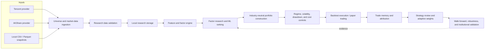

# Architecture

## Purpose and boundaries

The platform is organized as a local-first research pipeline. External providers supply replaceable data inputs; validation and storage establish a reproducible local snapshot; research and execution components operate from that snapshot. Generated market data, models, state, and HTML reports are excluded from version control, while code, configuration, tests, and concise Markdown findings remain reviewable.

## Major subsystems

| Subsystem | Main responsibility | Key locations |
| --- | --- | --- |
| Market data and universe | Obtain index members and daily histories through provider interfaces; retain local snapshots for repeatable runs. | `src/quant/data/`, `configs/universe_large.yaml` |
| Data validation and storage | Check required fields, dates, duplicates, coverage, and data readiness before downstream research. | `src/quant/data/validator.py`, `src/quant/data/storage.py` |
| Factors and features | Produce technical and risk-related factor columns and future-return labels. Factor registration keeps extensions modular. | `src/quant/factors/`, `src/quant/features.py` |
| Factor research and models | Calculate IC/Rank IC, coverage and stability; train ranking models using chronological partitions. | `src/quant/research/`, `src/quant/models/`, `src/quant/training.py` |
| Portfolio construction | Turn scores into constrained targets, including industry-neutral allocation and portfolio diagnostics. | `src/quant/portfolio/` |
| Risk management | Adjust exposure for market regime, realized volatility, and drawdown; account for turnover and execution costs. | `src/quant/regime/`, `src/quant/risk/`, `src/quant/backtest/` |
| Execution and paper trading | Simulate orders, fills, cash, and performance without broker connectivity. | `src/quant/backtest/execution.py`, `src/quant/paper/` |
| Memory and review | Persist decision context, realize exits, diagnose errors, attribute outcomes, and evolve factor weights. | `src/quant/memory/`, `src/quant/research/` |
| Institutional validation | Run walk-forward periods, perturbations, benchmark comparisons, and reporting. | `src/quant/validation/`, `src/quant/reporting.py` |

## Data flow

1. A provider retrieves constituent and price data, or a local snapshot is selected.
2. Validation rejects malformed or insufficient inputs before they enter factor research.
3. Factor and feature modules produce a date–security panel; labels are only used after their horizon has elapsed.
4. Factor diagnostics and ranking models output scores. Chronological splits and optional purging protect the training boundary.
5. Portfolio construction applies concentration and industry constraints. Risk controls scale the resulting exposure before execution.
6. Backtests and paper trading record trades, costs, equity curves, and decision context.
7. Attribution, trade memory, strategy review, and validation reports consume the recorded evidence. They inform research hypotheses but do not silently overwrite historical results.

## Reproducibility contract

The repository tracks the implementation, configuration, tests, and summarized validation evidence. It does not track raw provider downloads, fitted binaries, paper-trading account state, or generated dashboards. A reproducer should run `uv sync`, obtain data through the documented provider workflow, and execute the CLI validation commands. This separation avoids committing large or private runtime artifacts while preserving the exact research workflow.
